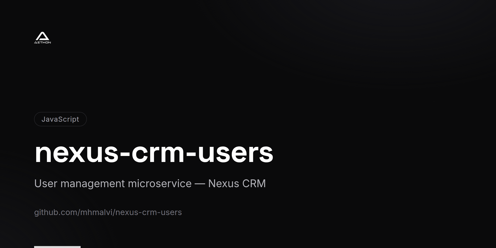
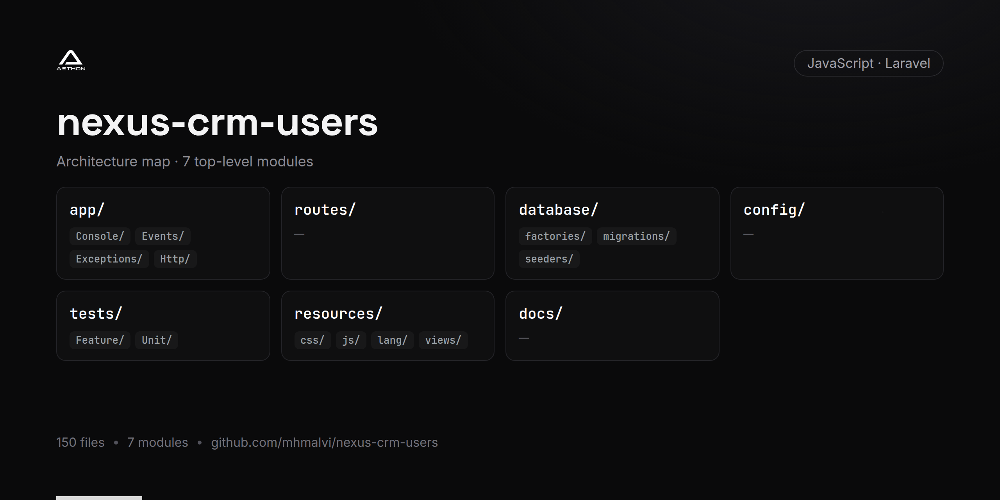

<!-- repo-card -->




# Nexus CRM Users

The user management and authentication microservice for the **Nexus CRM** platform. This Laravel-based API handles user registration, login, role-based access control, follow-up reminders, and real-time notifications via WebSockets.

## Features

- **User Registration & Authentication** — Secure sign-up and login with Laravel Sanctum token-based auth
- **Email Verification** — Verification code validation during registration
- **Password Recovery** — Forgot password and reset password flows with email notifications
- **Role-Based Access Control** — Support for multiple roles including admin, sales, and super admin
- **User Management** — Create, update, suspend, and delete user accounts
- **Sales Team Queries** — Dedicated endpoints for listing and filtering sales personnel
- **Follow-Up Reminders** — Schedule, update, and manage follow-up tasks for leads
- **Real-Time Notifications** — WebSocket-powered notification broadcasting via Laravel WebSockets
- **Notification Center** — List, read, and manage notification history
- **Stripe Integration** — Customer-level Stripe operations for subscription management
- **Trial Package Management** — Create and manage trial subscription packages

## Tech Stack

| Layer | Technology |
|-------|-----------|
| Framework | Laravel 8 |
| Language | PHP 7.3+ / 8.0+ |
| Authentication | Laravel Sanctum |
| WebSockets | beyondcode/laravel-websockets |
| Payments | Stripe PHP SDK |
| Database | MySQL |
| DB Migrations | Doctrine DBAL |
| HTTP Client | Guzzle |
| Testing | PHPUnit 9 |
| Code Style | StyleCI |

## Prerequisites

- PHP >= 7.3 (8.0+ recommended)
- Composer
- MySQL 5.7+ or MariaDB 10.3+

## Getting Started

1. **Clone the repository**

   ```bash
   git clone https://github.com/mhmalvi/nexus-crm-users.git
   cd nexus-crm-users
   ```

2. **Install dependencies**

   ```bash
   composer install
   ```

3. **Configure environment**

   ```bash
   cp .env.example .env
   php artisan key:generate
   ```

   Update `.env` with database credentials, mail settings, Stripe keys, and WebSocket configuration.

4. **Run database migrations**

   ```bash
   php artisan migrate
   ```

   Alternatively, import the provided `crm_user.sql` schema file.

5. **Start the development server**

   ```bash
   php artisan serve
   ```

6. **Start the WebSocket server** (optional, for real-time features)

   ```bash
   php artisan websockets:serve
   ```

   The API will be available at `http://localhost:8000`.

## API Overview

| Endpoint Group | Description |
|---------------|-------------|
| `POST /api/user/register` | Register a new user |
| `POST /api/user/login` | Authenticate and receive token |
| `POST /api/user/list` | List users with filters |
| `GET /api/user/{id}/details` | Get user profile details |
| `POST /api/user/update` | Update user information |
| `POST /api/user/status` | Change user active status |
| `POST /api/user/suspend` | Suspend user accounts |
| `POST /api/user/forgot-password` | Initiate password reset |
| `POST /api/follow-up` | Create a follow-up reminder |
| `POST /api/notifications-list` | Fetch user notifications |
| `GET /api/user/sales-list` | List sales team members |

## Microservices Integration

| Service | Interaction |
|---------|------------|
| nexus-crm-leads | Provides user/sales data for lead assignment |
| nexus-crm-orgs | Shares user context for company-level operations |
| nexus-crm-payments | Manages Stripe customer records |
| nexus-crm-alerts | Broadcasts real-time notification events |
| nexus-crm-b2b | Validates authentication tokens for B2B operations |

## License

This project is proprietary software. All rights reserved.
